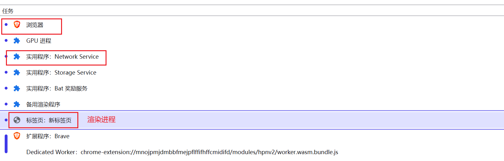
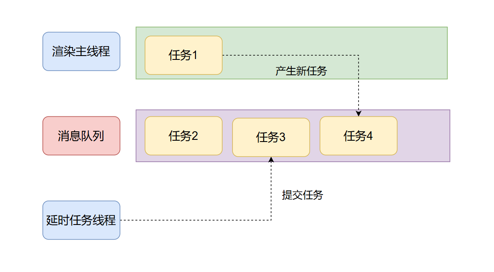
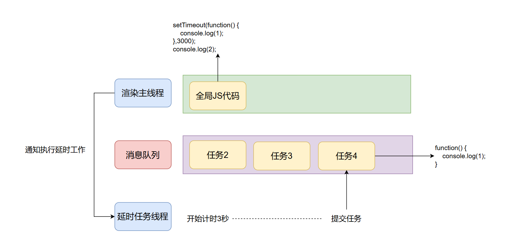
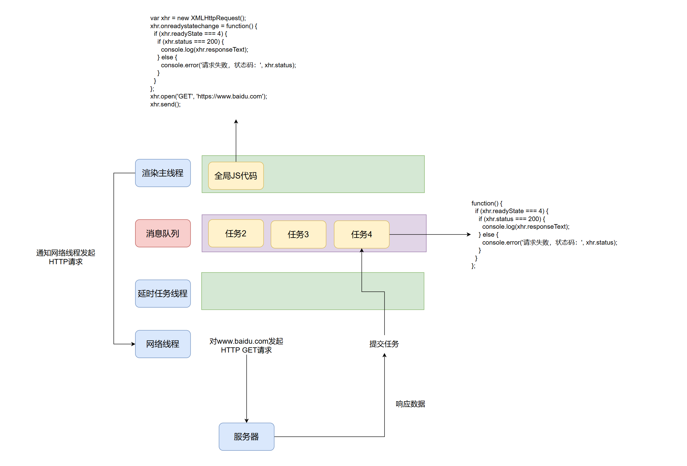
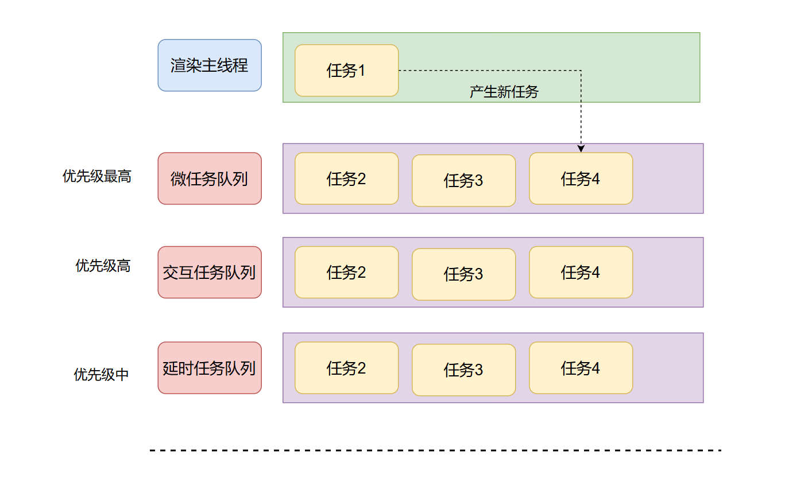

# 事件循环

探究技术的本质，享受技术的乐趣！你好，我是pandaer,今天我们来聊聊浏览器中的事件循环，这篇文章我会先从『我们为什么需要事件循环？』开始，带你探究一些**事件循环**的本质。接下来我们开始吧！

## 进程与线程，你不得不知道的知识！

进程与线程已经是我说过无数遍的内容了，为了保证内容的完整性，这里我就再啰嗦一下。进程（process）代表的是一个正在运行的程序，可以是微信，可以3A游戏。最直观的感受就是进程它占内存，它需要一大块独**立的内存空间**。所以进程更像一个工厂，工厂想工作就需要有工人，而线程（thread）就是工人，他负责执行具体的任务，如果想要工厂的工作效率快，那么就多加一些工人就好了。这就是**多线程**。

## 为什么我们要学习浏览器中的事件循环？

作为一位前端开发者，我们平常与浏览器打交道最为频繁，我们又有什么理由不去深入了解一下浏览器呢？和人一样，你经常和一个人打交道，让他帮你办点事，你一定会多花点时间去打听打听他的兴趣爱好，喜欢吃什么，投其所好，这样才能帮你把事情办好，办漂亮。那为什么我们不能这样对待浏览器呢？我们写的代码，无论是HTML，CSS，JavaScript，又或者你使用的框架Vue,React不都是需要交给浏览器，帮我们执行，渲染，展示吗？所以啊，多去了解浏览器只有好处没有坏处，而在浏览器中与CSS，HTML，JavaScript执行关系最大的就是事件循环，所以呀，彻底理解事件循坏对你的好处多多！

## 一些浏览器的基本知识！

在正式开聊事件循环之前，需要介绍一些浏览器的基本知识，浏览器是一个程序，但是这个程序发展至今演变成了一个**多进程多线程**的程序。通常而言，一个普通的程序都是**一个进程多个线程**，而浏览器之所以这样设计是因为浏览器干的事情太多了而且这些事情还都不简单，其复杂度不弱于一个操作系统，其中比较重要的任务有交互任务，渲染任务，网络任务。为了避免因为一个任务出错导致整个程序崩溃，所以将这些重要的任务都交给进程来做，因为进程有独立的空间，崩溃了也不会影响其他进程，就好比一个工厂发生了爆炸，不会影响其他工作的正常运行。于是浏览器就大致分为了这么几个进程，浏览器进程，网络进程，渲染进程。当然还有其他进程，可以使用浏览器自带的任务管理器查看，比如下图：



渲染进程目前是和标签页一一对应的，一个标签页一个渲染进程，但是后期可能会发生改变，一个站点对应一个渲染进程。当然这是题外话了。而这篇文章的主角**事件循环**就是**渲染进程**的工作方式！

## 为什么渲染进程会选择事件循环作为其工作方式呢？

这个时候你可能会产生一个疑惑，为什么渲染进程要选择事件循环作为它的工作方式呢？这和渲染进程**只有**一个线程有关，你也会会惊讶，渲染进程一看就是要负责渲染工作，解析HTML，解析CSS，解析JavaScript，执行JavaScript的，居然只有一个线程，不可思议！是的，最开始我也觉得不可能，但是在谷歌开源的chromium内核中，渲染进程中就只有一个线程在干活，我们把这个线程的名字叫做**渲染主线程**。因为渲染主线程做的任务与用户体验息息相关，比如渲染界面，所以我们的主线程一定不能做耗时的任务，不然在用户看来就是卡了，就是体验不好，就会抱怨。但是！但是！但是！怎么可能没有耗时的任务，比如网络请求，肯定得等到拿到数据之后才能渲染界面呀，比如延时任务，肯定得等到时间到了之后才能执行呀！为了满足**渲染主线程不阻塞**的同时**还可以执行这些比较耗时的任务**，浏览器选择了**异步**的处理方式，也就是咱们的主角 -- **事件循环**。

## 事件循环的核心模型

呼~，前面说了这么多，都是为了引出事件循环，这也是我写文章的风格，任何东西的出现都有其发展的脉络，都有其原因，沿着这些脉络学习，会让我们更有机会接触到事物的本质！那么现在我们就来看看事件循坏的工作原理吧！

渲染进程中只有一个渲染主线程，就好比只有一个工人要处理很多很多任务，那怎么办呢？只能一个一个处理呗！下图就是其工作原理



我来解释一下这个过程，渲染主线程在执行任务1的时候，其他任务会被其他的线程，或者其他进程中的线程提交到一个消息队列中，当渲染主线程执行完任务1之后，就从消息队列的对头取出一个新任务，在图中就是任务2，然后继续执行。按照这样的工作模式不断的重复下去，所以叫做事件循环，这里的事件其实就是一个等待执行的任务。

接下来我们来考虑两类比较特殊的任务，一类是延时任务，一类是网络任务。先看延时任务

### 延时任务是如何执行的呢？

我们先考虑下面这段代码

```js
setTimeout(function() {
    console.log(1);
},3000);
console.log(2);
```

大致的工作原理如下：



我来解释一下这个过程，当我们渲染主线程执行这段代码的时候，发现是一个延时任务，就通知延时任务线程准备开启一个计时，并在计时结束后提交一个新任务，在图中就是**任务4**，也就是代码中的**回调函数**。然后渲染线程继续执行这段JS代码，输出2，当这段代码执行完成之后，这个任务也就执行完毕，然后从消息队列中提取出新的任务继续执行，当执行到任务4的时候，也就是我们的延时任务的时候，就会输出1。在这个过程中也说明了延时任务并不是精准的延迟，这里的延时只不是过是最少延时多少时间才执行。

理解了这种工作模式，相信你也理解了为什么JS的代码中充斥着回调函数了吧，其实就是为了将一些耗时的函数从**同步的等待**转换为**异步的通知**。比如上面这个例子中的延时任务，从渲染主线程干等三秒钟再执行对应的代码，变成了通知某个线程计时，等时间到了通知我。这个过程中等待不可避免，只不过这个等待从一个线程转移到了另外一个线程中。在上面那个例子中，就是从有很多工作要做的渲染主线程中转移到了没多少事的延时任务线程中。

### 网络请求是如何执行的呢？

发起网络请求的例子也不例外，和延时任务的工作模型一致，参考下面这段代码

```js
var xhr = new XMLHttpRequest();
xhr.onreadystatechange = function() {
  if (xhr.readyState === 4) {
    if (xhr.status === 200) {
      console.log(xhr.responseText);
    } else {
      console.error('请求失败，状态码：', xhr.status);
    }
  }
};
xhr.open('GET', 'https://www.baidu.com');
xhr.send();
```

具体的工作模式如下图：




上述的过程与延时任务的过程基本一致，当渲染主线程执行JS代码的时候，发现需要发起一个网络请求，于是通知网络线程，由网络线程发起一个真正的HTTP请求，当服务器返回数据的时候，提交一个任务，这个任务就是提前设置的**回调函数**，当渲染主线程从消息队列中获取到这个任务的时候，也就是图中的**任务4**，就能够获取到服务器返回的数据了。

以上就是整个事件循环的核心原理，最最最本质的内容，下面我们来看看事件循环的演进。

## 事件循环的演进！

技术不断的发展，浏览器在不断的进步，为了适应这种进步，事件循环也发生了一些改变，但是其核心原理没有变，只是在此基础上做了一些优化。渲染主线程负责的任务，总有些任务比较急吧，比如与用户体验息息相关的交互任务，以及渲染任务，这些任务肯定比普通的延时任务要急的多吧！那如何让这些任务先执行呢？浏览器引入了微队列的概念，也就是事件循环的队列不只一个，可以有多个而且还有优先级的特点，微队列的优先级比宏队列的优先级高，必须先执行微队列中的任务，只有微队列空了才能执行宏队列中的任务。随着浏览器的进一步发展，宏队列的说法渐渐被抛弃了，改为了**同一类型的任务一个队列，不同类型的任务也可以在同一个队列中**。换句话说就是队列从原来的两个变成了现在的多个，比如在Chrome浏览器中就有延时任务队列，交互任务队列，而且交互任务队列的优先级比延时任务的优先级高。无论有多少个队列，必须保证有一个微任务队列，而且这个队列的优先级最高。我们在JS代码中的Promise中设置的回调函数就是进入微队列中。下图是目前完整的事件循环架构图：



# 一些闲聊！

事件循环就聊到这里，我想说的是任何技术都是不断迭代出来的，对于我们学习者而言，如果你想真正的理解这些技术，我们应该去梳理其发展脉络，而不是只看当前的最新实现。


